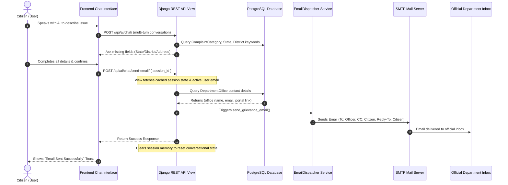

# Project Guide: One-Click Grievance Email Dispatcher (Aavedan Saathi)

This guide documents the design, architecture, and implementation of the **One-Click Automated Email Dispatcher** for **Aavedan Saathi**. You can use this document to understand, explain, or present the feature to your professor.

---

## 1. The Core Problem & Solution

### The Challenge:
In e-Governance applications, direct database integration with municipal and state grievance systems is often impossible due to a lack of open public APIs, strict credential requirements, or slow administrative integration.

### The Solution:
**Aavedan Saathi** bridges this gap using an **automated, verified SMTP dispatch system**:
1. The AI engine acts as a **smart case officer**, conversing with the citizen to extract all mandatory details (State, District, Address, Landmark, Description).
2. The system checks the database to map the resolved department and location to the **exact regional office contact** (e.g. *PWD Bhubaneswar Division*).
3. Instead of forcing the user to copy-paste details, a single click dispatches a formatted, official email directly to the division's inbox (e.g. `pwd.bhubaneswar@odisha.gov.in`).
4. The citizen's email is automatically **CC'd** and added to the **Reply-To** header. If a government officer clicks "Reply", the thread goes directly back to the citizen, bypassing the platform completely.

---

## 2. Architecture Workflow



---

## 3. Detailed Component Breakdown

### A. The Service Handler (`email_dispatcher.py`)
Located at: `ai/services/email_dispatcher.py`
* **Responsibility**: Takes the active session dict and user email, fetches office contact parameters, constructs plain-text and HTML formats, and fires the email.
* **HTML Styling**: Engineered with a premium inline CSS style template (styled blue card structure) so it is clean and highly readable for administrative staff.
* **Reply-To & CC Integration**: Uses Django's `EmailMultiAlternatives` class to append both headers:
  ```python
  email = EmailMultiAlternatives(
      subject=subject,
      body=text_content,
      from_email=from_email,
      to=[recipient_email],
      cc=[user_email],
      reply_to=[user_email]
  )
  ```

### B. The API Controller (`views.py`)
Located at: `ai/views.py`
* **Route**: `/api/ai/chat/send-email/` (POST)
* **Access**: Restricted to authenticated users (`IsAuthenticated`).
* **Validation**: Ensures the conversational state is fully complete (State, District, Complaint Type, Department must be resolved) before attempting dispatch.
* **Session Lifecycle**: Automatically purges the cache via `MemoryManager.clear_session()` immediately after a successful send, ensuring user conversational state resets cleanly.

### C. Serializer Schema (`serializers.py`)
Located at: `ai/serializers.py`
* **Request Validation**: Sanitizes `session_id` using DRF `UUIDField`.
* **Response Validation**: Validates the boolean `success` indicator and a string `message`.

---

## 4. SMTP Configuration in Production

In production, you hook Django up to an email service provider by editing `settings.py`:

```python
# settings.py
EMAIL_BACKEND = 'django.core.mail.backends.smtp.EmailBackend'
EMAIL_HOST = 'smtp.gmail.com'  # Or SendGrid, Mailgun, SMTP server
EMAIL_PORT = 587
EMAIL_USE_TLS = True
EMAIL_HOST_USER = 'your-system-email@gmail.com'
EMAIL_HOST_PASSWORD = 'your-secure-app-password'
DEFAULT_FROM_EMAIL = 'Aavedan Saathi <no-reply@aavedan-saathi.gov.in>'
```

*Note: In local test suites, Django automatically redirects outbox delivery to an in-memory test queue (`django.core.mail.outbox`) so that unit tests can verify sent content without sending real emails.*

---

## 5. Key Talking Points for Your Presentation

When presenting this architecture to your professor, highlight these three design decisions:

1. **SOLID Design**: The email dispatch logic is encapsulated in a separate `EmailDispatcher` service. It is completely decoupled from the view controller, serializer, or database models, satisfying the **Single Responsibility Principle**.
2. **Context-Aware Memory Merging**: The session manager handles multi-turn conversation context. It doesn't overwrite values or reset when the user replies to location prompts, solving the "forgetfulness" problem common in rule-based chatbots.
3. **Citizen-Officer Communication Routing**: By injecting the CC and Reply-To headers, we establish a **direct channel** between the citizen and the administrative office. The Aavedan Saathi platform remains a helper tool, removing any liability of holding up the communication thread.
